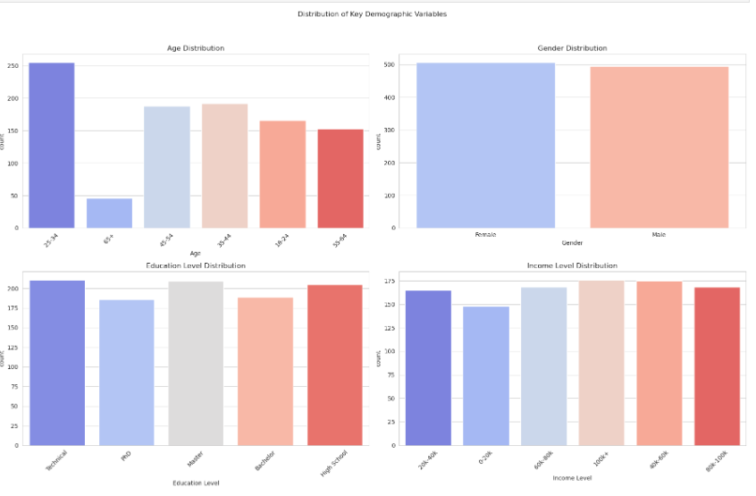
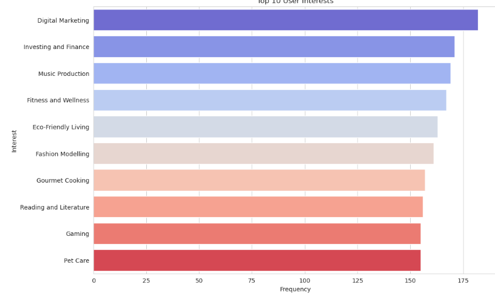
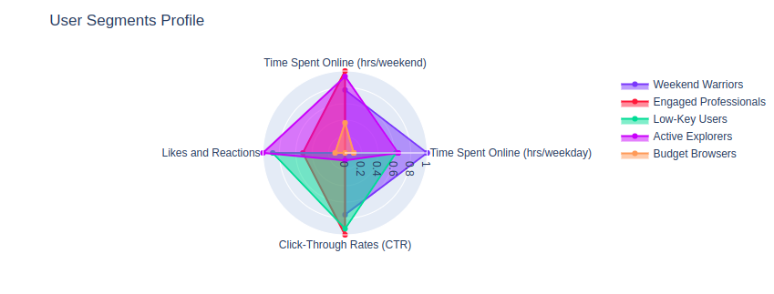

# User Profiling and Segmentation in Python

## Overview
User profiling and segmentation are essential techniques in understanding user behavior and preferences. This project aims to create detailed user profiles and segment the user base into distinct groups, enabling targeted marketing and personalized experiences.

## Table of Contents
- [Objectives](#objectives)
- [Data Collection](#data-collection)
- [Feature Engineering](#feature-engineering)
- [Segmentation Techniques](#segmentation-techniques)
- [User Profiles](#user-profiles)
- [Results](#results)
- [Graphs and Visualizations](#graphs-and-visualizations)
- [Conclusion](#conclusion)
- [License](#license)

## Objectives
The primary objectives of this project are:
- Improve customer service through better understanding of user needs.
- Enhance personalized marketing strategies.
- Provide product recommendations based on user behavior.

## Data Collection
Data was collected from various sources, including:
- User interactions on websites and apps
- Transaction histories
- Social media activity
- Demographic information

## Feature Engineering
New features were created to capture relevant user behaviors and preferences. This involved:
- Aggregating transaction data
- Calculating the frequency of activities
- Extracting patterns from usage logs

## Segmentation Techniques
The following segmentation techniques were applied:
- K-Means Clustering
- Hierarchical Clustering
- DBSCAN

## User Profiles
For each segment identified, user profiles were created summarizing the key characteristics and behaviors of users in that segment. This includes demographic, psychographic, and behavioral attributes.

## Results
The segmentation revealed distinct user groups, allowing for tailored marketing strategies and improved user engagement.

## Graphs and Visualizations
Here are some visualizations that illustrate the results of the user profiling and segmentation:

### Graph 1: User Segmentation Distribution

### Graph 2: Key Characteristics of User Segments

### Graph 3: Behavioral Patterns by Segment

## Conclusion
User profiling and segmentation are powerful tools that enable data professionals to understand their user base in-depth. By tailoring strategies to meet diverse user needs, businesses can improve customer satisfaction and drive engagement.

## License
This project is licensed under the MIT License - see the [LICENSE](LICENSE) file for details.
